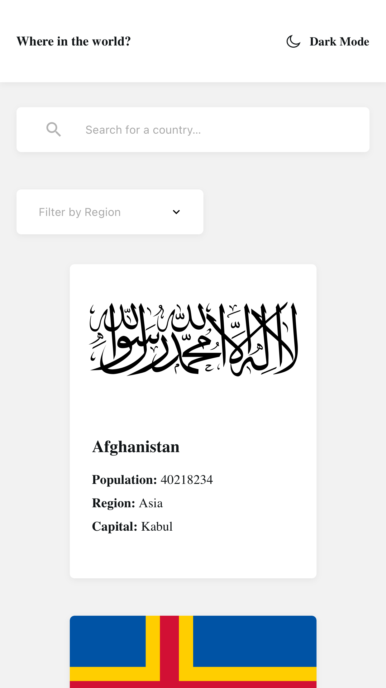
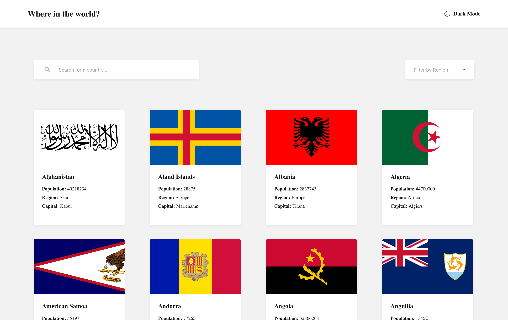

# Frontend Mentor - REST Countries API with color theme switcher solution

This is a solution to the [REST Countries API with color theme switcher challenge on Frontend Mentor](https://www.frontendmentor.io/challenges/rest-countries-api-with-color-theme-switcher-5cacc469fec04111f7b848ca). Frontend Mentor challenges help you improve your coding skills by building realistic projects.

## Table of contents

- [Frontend Mentor - REST Countries API with color theme switcher solution](#frontend-mentor---rest-countries-api-with-color-theme-switcher-solution)
  - [Table of contents](#table-of-contents)
  - [Overview](#overview)
  - [My process](#my-process)
  - [Author](#author)

**Note: Delete this note and update the table of contents based on what sections you keep.**

## Overview

### The challenge

Users should be able to:

- See all countries from the API on the homepage
- Search for a country using an `input` field
- Filter countries by region
- Click on a country to see more detailed information on a separate page
- Click through to the border countries on the detail page
- Toggle the color scheme between light and dark mode _(optional)_

### Screenshot

Mobile:



Desktop:



### Links

- Solution URL: [Add solution URL here](https://your-solution-url.com)
- Live Site URL: [Add live site URL here](https://your-live-site-url.com)

## My process

### Built with

- Semantic HTML5 markup
- Local Storage
- SCSS with CSS variable
- CSS Grid Layout
- Mobile-first workflow
- [Vue 3](https://vuejs.org) - Vue 3 JS library
- [Vue Router](https://router.vuejs.org) - Vue Router
- [Pinia](https://pinia.vuejs.org) - Pinia store

### What I learned

I learned how to use matchMedia method in window object to match CSS prefers-color-scheme property. With local storage I could make dark mode functionality.

```js
// ...
} else if (window?.matchMedia('(prefers-color-scheme: dark)').matches) {
    theme = 'dark'
}
// ...
```

### Useful resources

- [How to override css prefers-color-scheme setting](https://stackoverflow.com/questions/56300132/how-to-override-css-prefers-color-scheme-setting) - This helped me for doing media match by js.

## Author

- GitHub - [Oliver Young](https://github.com/oliyg)
- Frontend Mentor - [@oliyg](https://www.frontendmentor.io/profile/oliyg)
