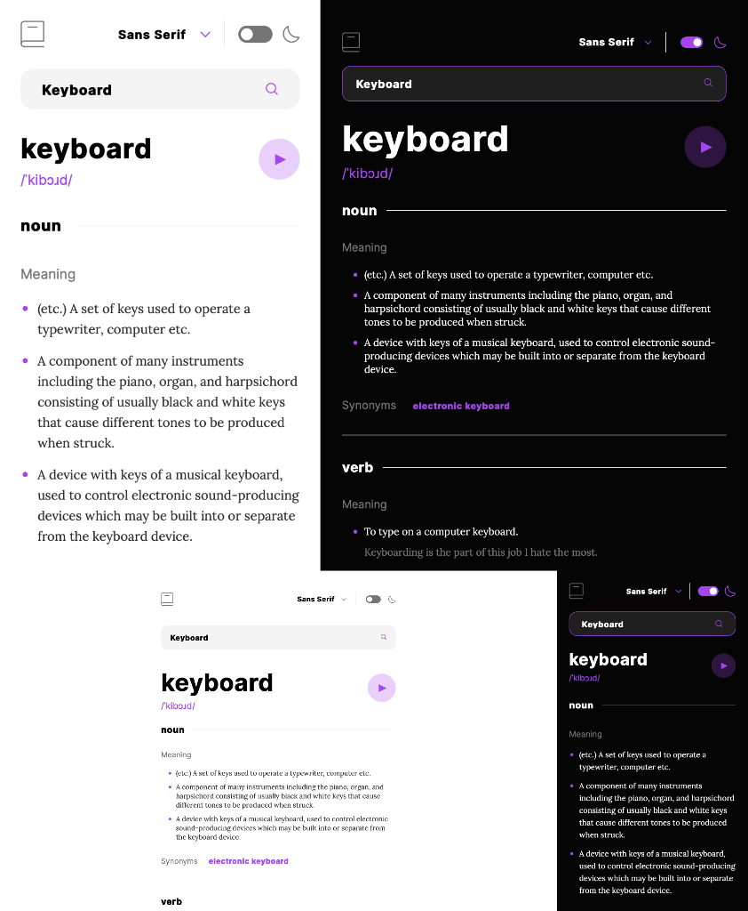

# Frontend Mentor - Dictionary web app solution

This is a solution to the [Dictionary web app challenge on Frontend Mentor](https://www.frontendmentor.io/challenges/dictionary-web-app-h5wwnyuKFL). Frontend Mentor challenges help you improve your coding skills by building realistic projects.

## Table of contents

- [Frontend Mentor - Dictionary web app solution](#frontend-mentor---dictionary-web-app-solution)
  - [Table of contents](#table-of-contents)
  - [Overview](#overview)
  - [My process](#my-process)
  - [Author](#author)

## Overview

### The challenge

Users should be able to:

- Search for words using the input field
- See the Free Dictionary API's response for the searched word
- See a form validation message when trying to submit a blank form
- Play the audio file for a word when it's available
- Switch between serif, sans serif, and monospace fonts
- Switch between light and dark themes
- View the optimal layout for the interface depending on their device's screen size
- See hover and focus states for all interactive elements on the page
- **Bonus**: Have the correct color scheme chosen for them based on their computer preferences. _Hint_: Research `prefers-color-scheme` in CSS.

### Screenshot

### Links

- Solution URL: [Dictionary Web App](https://github.com/oliyg/frontendmentor/tree/master/dictionary)
- Live Site URL: [Dictionary Web App](https://dictionary-web-app-rho.vercel.app/)

## My process

### Built with

- Semantic HTML5 markup
- CSS custom properties
- Flexbox
- Mobile-first workflow
- TypeScript
- ESLint & Prettier
- [Vue](https://vuejs.org) - JS library
- [Vite](https://vitejs.dev) - FrontEnd Tooling
- [Pinia](https://pinia.vuejs.org) - Store
- [Vue Router](https://router.vuejs.org) - Router
- [Tailwindcss](https://tailwindcss.com) - For styles

### What I learned

I learned how to use **Tailwind** to styling the elements.

Here is an article [CSS Utility Classes and "Separation of Concerns"](https://adamwathan.me/css-utility-classes-and-separation-of-concerns/) explained why we use tailwind.

And after reading this artile, I write something here [comment](https://dev.to/oliyg/comment/26ifo).

### Useful resources

- [CSS Utility Classes and "Separation of Concerns"](https://adamwathan.me/css-utility-classes-and-separation-of-concerns/)

## Author

- GitHub - [@oliyg](https://github.com/oliyg)
- Frontend Mentor - [@oliyg](https://www.frontendmentor.io/profile/oliyg)
